= Ignacio High Throughput Java Project

image:https://github.com/JuanPabloJimenezEsclusa/ignacio-high-throughput/actions/workflows/maven.yml/badge.svg["Deploy", link="https://github.com/JuanPabloJimenezEsclusa/ignacio-high-throughput/actions/workflows/maven.yml"]
image:https://github.com/JuanPabloJimenezEsclusa/ignacio-high-throughput/actions/workflows/sonarqube.yml/badge.svg["SonarQube", link="https://github.com/JuanPabloJimenezEsclusa/ignacio-high-throughput/actions/workflows/sonarqube.yml"]
image:https://github.com/JuanPabloJimenezEsclusa/ignacio-high-throughput/actions/workflows/dependency-review.yml/badge.svg["Dependencies", link="https://github.com/JuanPabloJimenezEsclusa/ignacio-high-throughput/actions/workflows/dependency-review.yml"]
image:https://img.shields.io/github/license/JuanPabloJimenezEsclusa/ignacio-high-throughput["License", link="https://github.com/JuanPabloJimenezEsclusa/ignacio-high-throughput/LICENSE.md"]

<<_project_structure,Project Structure>>
  | <<_technologies,Technologies>>
  | <<_building_modules,Building Modules>>
  | <<_running_modules,Running Modules>>
  | <<_api_endpoints,API Endpoints>>
  | <<_deployment,Deployment>>
  | <<_profiling,Profiling>>
  | <<_testing,Testing>>
  | <<_performance_comparison,Performance Comparison>>
  | <<_references,References>>

****
 A comprehensive empirical study evaluating the performance characteristics and scalability patterns of high-throughput data processing architectures in Java, comparing traditional thread-per-request imperative models with event-loop reactive paradigms.

 This research implements controlled experimental scenarios across six distinct runtime configurations, analyzing the impact of virtual thread utilization and native compilation on response latency, resource efficiency, and throughput optimization.

 Quantitative performance metrics are systematically collected through industry-standard profiling tools and benchmarking methodologies to provide statistically significant insights into the architectural trade-offs between imperative and reactive programming models under varying computational loads.
****

[#_project_structure]
== 📦 Project Structure

This is a multi-module project consisting of::

* *link:./imperative-throughput[imperative-throughput]*: Traditional Spring MVC implementation using blocking operations
* *link:./reactive-throughput[reactive-throughput]*: Spring WebFlux implementation using non-blocking reactive streams

[#_technologies]
== 🛠️ Technologies

image:https://img.shields.io/badge/OpenJDK-24+-005571.svg["OpenJDK",link="https://adoptium.net/es/temurin/releases/?os=any&arch=any&version=24"]
image:https://img.shields.io/badge/GraalVM-24+-005571.svg["GraalVM",link="https://www.graalvm.org/jdk24/getting-started/linux/#script-friendly-urls"]
image:https://img.shields.io/badge/Maven-3.9+-005571.svg["Maven",link="https://maven.apache.org/ref/3.9.10/"]
image:https://img.shields.io/badge/Gradle-8.14+-005571.svg["Gradle",link="https://docs.gradle.org/8.14.2/userguide/userguide.html"]

image:https://img.shields.io/badge/Spring%20Boot-3.5+-brightgreen.svg["Spring Boot",link="https://spring.io/projects/spring-boot"]
image:https://img.shields.io/badge/Spring%20MVC%20(imperative%20module)-6.2+-brightgreen.svg["Spring MVC",link="https://docs.spring.io/spring-framework/reference/web.html"]
image:https://img.shields.io/badge/Spring%20Webflux%20(reactive%20module)-6.2+-brightgreen.svg["Spring WebFlux",link="https://docs.spring.io/spring-framework/reference/web-reactive.html"]

image:https://img.shields.io/badge/K6-1.0+-orange.svg["k6",link="https://github.com/grafana/k6"]
image:https://img.shields.io/badge/JMeter-5.6+-orange.svg["JMeter",link="https://jmeter.apache.org/"]
image:https://img.shields.io/badge/Gatling-3.14+-orange.svg["Gatling",link="https://github.com/gatling/gatling"]

image:https://img.shields.io/badge/Docker-28+-brown.svg["Docker",link="https://docs.docker.com/engine/release-notes/28/"]
image:https://img.shields.io/badge/Docker%20Compose-v2.37+-brown.svg["Docker-compose",link="https://docs.docker.com/compose/install/standalone/"]
image:https://img.shields.io/badge/Kubernetes-1.33+-brown.svg["Kubernetes",link="https://kubernetes.io/releases/"]
image:https://img.shields.io/badge/AWS%20CLI-2.27+-brown.svg["AWS CLI",link="https://aws.amazon.com/es/cli/"]

[#_building_modules]
== 🔨 Building modules

[source,bash]
----
# Build all modules
mvn clean package
----

[source,bash]
----
# Build all modules with Gradle
gradle clean build
----

[source,bash]
----
export SPRING_PROFILES_ACTIVE="native"
# Build native artifacts
mvn -P"${SPRING_PROFILES_ACTIVE}" \
  native:compile \
  -Dmaven.test.skip=true \
  -Dmaven.build.cache.enabled=false \
  --projects imperative-throughput,reactive-throughput
----

[source,bash]
----
gradle nativeBuild
----

Reports::
* link:./imperative-throughput/target/imperative-throughput-build-report.html[Build Native Report - imperative-throughput]
* link:./reactive-throughput/target/reactive-throughput-build-report.html[Build Native Report - reactive-throughput]

[source,bash]
----
export SPRING_PROFILES_ACTIVE="native"
# Build docker images
mvn -P"${SPRING_PROFILES_ACTIVE}" \
  spring-boot:build-image \
  -Dmaven.test.skip=true \
  -Dmaven.build.cache.enabled=false \
  --projects imperative-throughput,reactive-throughput
----

[source,bash]
----
gradle bootBuildImage
----

[#_running_modules]
== 🚀 Running modules

=== Imperative Module

[source,bash]
----
# Run with Maven
mvn spring-boot:run -f imperative-throughput/pom.xml
----

[source,bash]
----
# Run with Gradle
gradle bootRun --project-dir imperative-throughput
----

[source,bash]
----
# Run java -jar
# Include init profiling for recording during 10 minutes and dump when exit
java -XX:+FlightRecorder \
  -XX:StartFlightRecording=filename=resource-profiling/imperative-recording.jfr,settings=resource-profiling/custom.jfc,dumponexit=true,duration=10m \
  -jar ./imperative-throughput/target/imperative-throughput-1.0.0.jar
----

[source,bash]
----
# Run native artifact
./imperative-throughput/target/imperative-throughput \
  -XX:+FlightRecorder \
  -XX:StartFlightRecording=filename=resource-profiling/imperative-recording.jfr,settings=resource-profiling/custom.jfc,dumponexit=true,duration=10m
----

[source,bash]
----
# Run native artifact built with Gradle
./imperative-throughput/build/native/nativeCompile/imperative-throughput
----

[source,bash]
----
# Run docker image
docker run -it --rm \
  --memory="1024m" \
  --memory-reservation="0m" \
  --memory-swap="1024m" \
  --cpus="1.000" \
  --env BPL_JMX_ENABLED=true \
  --env BPL_JMX_PORT=5088 \
  --env BPL_JMX_RMI_PORT=5088 \
  --env BPL_JMX_HOST=0.0.0.0 \
  --env BPL_JMX_RMI_HOST=0.0.0.0 \
  --publish 8888:8888 \
  --publish 5088:5088 \
  imperative-throughput:1.0.0
----

The application will be available at: `http://localhost:8888/imperative-throughput/`

=== Reactive Module

[source,bash]
----
# Run with Maven
mvn spring-boot:run -f reactive-throughput/pom.xml
----

[source,bash]
----
# Run with Gradle
gradle bootRun --project-dir reactive-throughput
----

[source,bash]
----
# Run java -jar
java -XX:+FlightRecorder \
  -XX:StartFlightRecording=filename=resource-profiling/reactive-recording.jfr,settings=resource-profiling/custom.jfc,dumponexit=true,duration=10m \
  -jar ./reactive-throughput/target/reactive-throughput-1.0.0.jar
----

[source,bash]
----
# Run native artifact
./reactive-throughput/target/reactive-throughput \
  -XX:+FlightRecorder \
  -XX:StartFlightRecording=filename=resource-profiling/reactive-recording.jfr,settings=resource-profiling/custom.jfc,dumponexit=true,duration=10m
----

[source,bash]
----
# Run native artifact built with Gradle
./reactive-throughput/build/native/nativeCompile/reactive-throughput
----

[source,bash]
----
# Run docker image
docker run -it --rm \
  --memory="1024m" \
  --memory-reservation="0m" \
  --memory-swap="1024m" \
  --cpus="1.000" \
  --env BPL_JMX_ENABLED=true \
  --env BPL_JMX_PORT=5099 \
  --env BPL_JMX_RMI_PORT=5099 \
  --env BPL_JMX_HOST=0.0.0.0 \
  --env BPL_JMX_RMI_HOST=0.0.0.0 \
  --publish 9999:9999 \
  --publish 5099:5099 \
  reactive-throughput:1.0.0
----

The application will be available at: `http://localhost:9999/reactive-throughput/`

[#_api_endpoints]
== 🔌 API Endpoints

=== Imperative Module

* `GET /imperative-throughput/smokes` - Returns "OK" after a 300ms delay using blocking Thread#sleep

[source,bash]
----
# Request endpoint
curl -sv http://localhost:8888/imperative-throughput/smokes
----

[source,bash]
----
# Health check
curl -sv http://localhost:8888/imperative-throughput/actuator/health | jq
----

[source,bash]
----
# Metrics
curl -sv http://localhost:8888/imperative-throughput/actuator/prometheus
curl -sv http://localhost:8888/imperative-throughput/actuator/metrics | jq
----

=== Reactive Module

* `GET /reactive-throughput/smokes` - Returns "OK" after a 300ms delay using reactive non-blocking delay

[source,bash]
----
# Request endpoint
curl -sv http://localhost:9999/reactive-throughput/smokes
----

[source,bash]
----
# Health check
curl -sv http://localhost:9999/reactive-throughput/actuator/health | jq
----

[source,bash]
----
# Metrics
curl -sv http://localhost:9999/reactive-throughput/actuator/prometheus
curl -sv http://localhost:9999/reactive-throughput/actuator/metrics | jq
----

[#_deployment]
== 🛠️ Deployment

Deploy the application to a local or cloud environment using one of the following options:

[cols="1,1,1", options="header", width=100%, frame=none, grid=none, title="Deployment Diagrams"]
|===
| image:https://img.shields.io/badge/Local-Docker%20Compose-005571.svg[link="./deploy-orchestrator/docker-compose/Readme.md"] | image:https://img.shields.io/badge/Local-K8s%20Kind-005571.svg[link="./deploy-orchestrator/k8s-kind/Readme.md"] | image:https://img.shields.io/badge/Cloud-AWS%20ECS-005571.svg[link="./deploy-orchestrator/aws-ecs/Readme.md"]
| image:./deploy-orchestrator/docker-compose/images/high-throughput-docker-diagram.svg[Compose Diagram] | image:./deploy-orchestrator/k8s-kind/images/high-throughput-k8s-diagram.svg[Kind Diagram] | image:./deploy-orchestrator/aws-ecs/images/high-throughput-aws-cf-diagram.svg[ECS Diagram]
|===

[#_profiling]
== 📊 Profiling

* link:https://www.graalvm.org/jdk24/reference-manual/native-image/debugging-and-diagnostics/jcmd/[Diagnostic Command Tool (jcmd)]

[source,bash]
----
# List JVM processes
jcmd -l
# Look for the imperative-throughput process
IMPERATIVE_PROCESS_ID="$(pgrep -f imperative-throughput-1.0.0.jar)"
# List available e
jcmd "${IMPERATIVE_PROCESS_ID}" help
# Dump the thread information to a file
jcmd "${IMPERATIVE_PROCESS_ID}" Thread.dump_to_file -format=json \
  -overwrite resource-profiling/imperative-throughput.hprof.json
----

[source,bash]
----
# List JVM processes
jcmd -l
# Look for the reactive-throughput process
`REACTIVE_PROCESS_ID="$(pgrep -f reactive-throughput-1.0.0.jar)"`
# List available e
jcmd "${REACTIVE_PROCESS_ID}" help
# Dump the thread information to a file
jcmd "${REACTIVE_PROCESS_ID}" Thread.dump_to_file -format=json \
  -overwrite resource-profiling/reactive-throughput.hprof.json
----

* link:https://www.graalvm.org/latest/reference-manual/native-image/debugging-and-diagnostics/JFR/[JDK Flight Recording (jfr)]

[source,bash]
----
# Some events are not enabled by default
jfr configure --output resource-profiling/custom.jfc \
  jdk.VirtualThreadStart#enabled=true \
  jdk.VirtualThreadEnd#enabled=true
----

[source,bash]
----
# Look for the imperative-throughput process
IMPERATIVE_PROCESS_ID="$(pgrep -f imperative-throughput-1.0.0.jar)"
# Start,dump,stop the recording
jcmd "${IMPERATIVE_PROCESS_ID}" JFR.start settings=resource-profiling/custom.jfc
jcmd "${IMPERATIVE_PROCESS_ID}" JFR.dump filename=resource-profiling/imperative-recording.jfr
jcmd "${IMPERATIVE_PROCESS_ID}" JFR.stop
# Summarize the recording
jfr summary resource-profiling/imperative-recording.jfr | grep -e ".*Thread.*"
jfr print --json --events all --recording resource-profiling/imperative-recording.jfr \
  > resource-profiling/imperative-recording.hprof.json
----

[source,bash]
----
# Look for the reactive-throughput process
REACTIVE_PROCESS_ID="$(pgrep -f reactive-throughput-1.0.0.jar)"
# Start,dump,stop the recording
jcmd "${REACTIVE_PROCESS_ID}" JFR.start settings=resource-profiling/custom.jfc
jcmd "${REACTIVE_PROCESS_ID}" JFR.dump filename=resource-profiling/reactive-recording.jfr
jcmd "${REACTIVE_PROCESS_ID}" JFR.stop
# Summarize the recording
jfr summary resource-profiling/reactive-recording.jfr | grep -e ".*Thread.*"
jfr print --json --events all --recording resource-profiling/reactive-recording.jfr \
  > resource-profiling/reactive-recording.hprof.json
----

* link:https://github.com/openjdk/jmc[Java Mission Control (jmc)]

[source,bash]
----
# Download, extract and run
tar zxf jmc-9.1.0_linux-x64.tar.gz
./jmc-9.1.0_linux-x64/JDK\ Mission\ Control/jmc
----

[cols="1,1", options="header", width=100%, frame=none, grid=none, title="Imperative vs Reactive (native build)"]
|===
| Imperative | Reactive

| 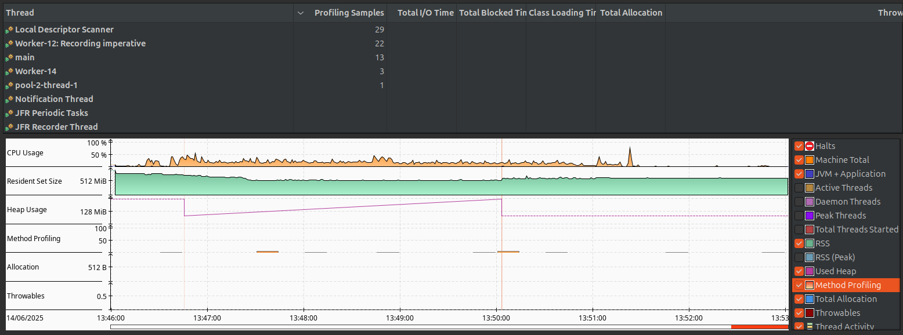
| 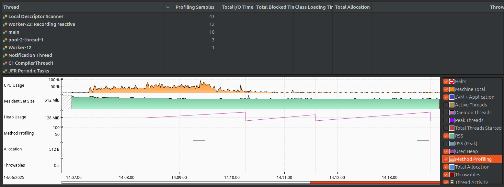

| 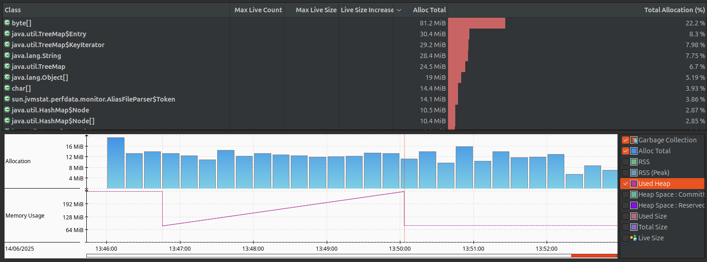
| 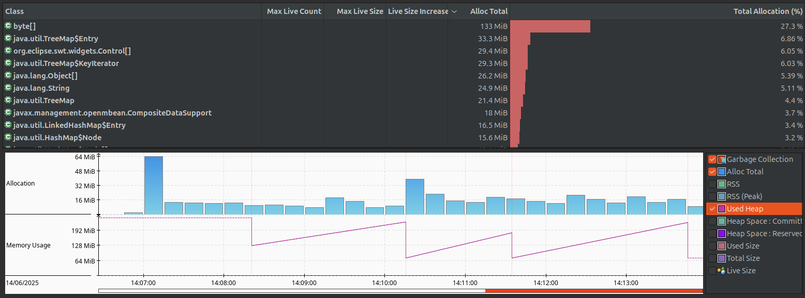

| 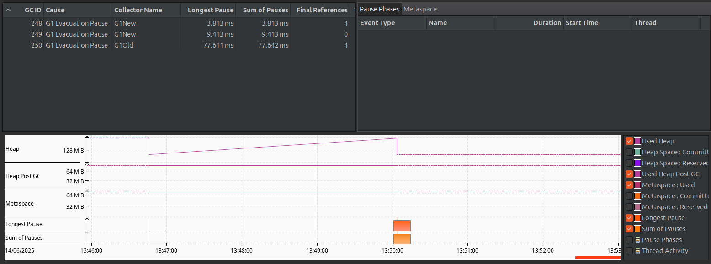
| 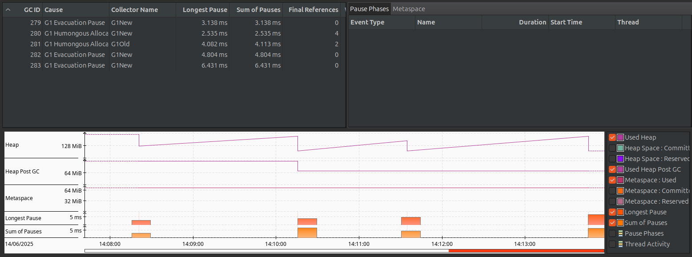

| 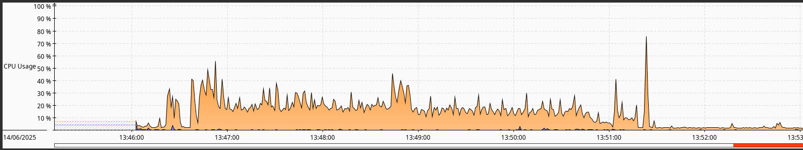
| 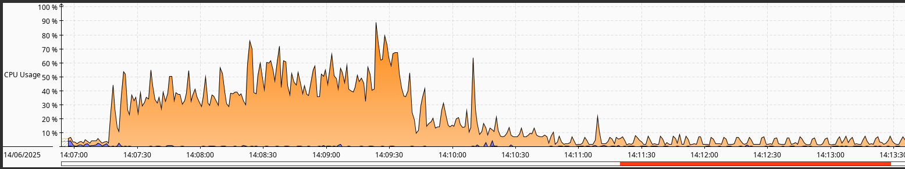
|===

* link:https://visualvm.github.io/[VisualVM]

[source,bash]
----
# Download, extract and run
unzip visualvm_22.zip
./visualvm_22/bin/visualvm
----

[cols="1,1", options="header", width=100%, frame=none, grid=none, title="Imperative vs Reactive (jar)"]
|===
| Imperative | Reactive

| 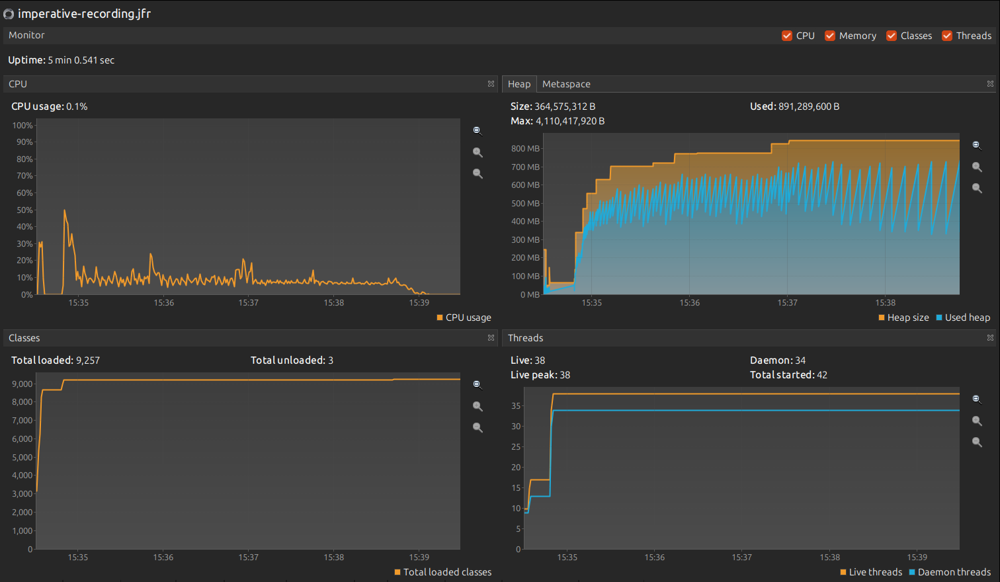
| 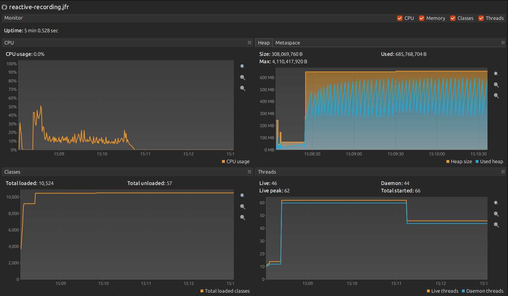

| 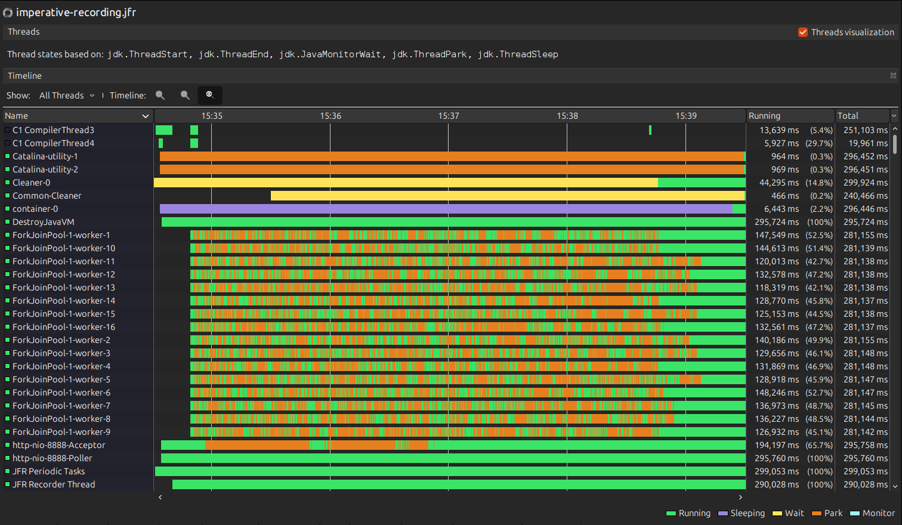
| 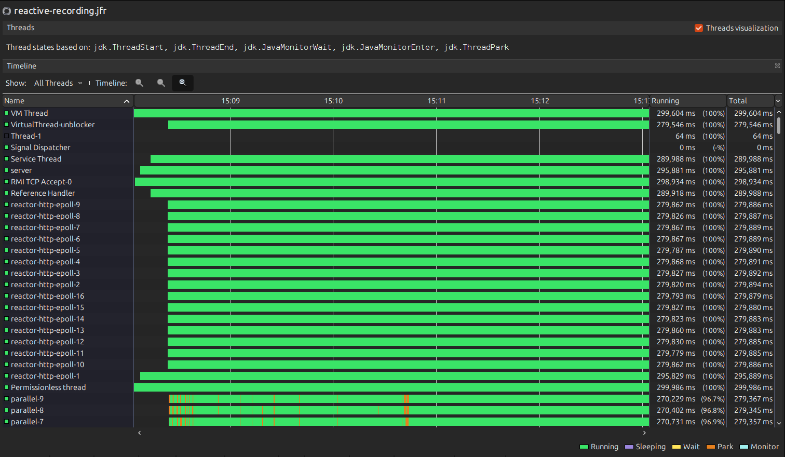

| 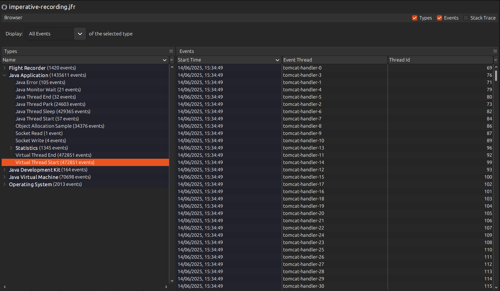
| 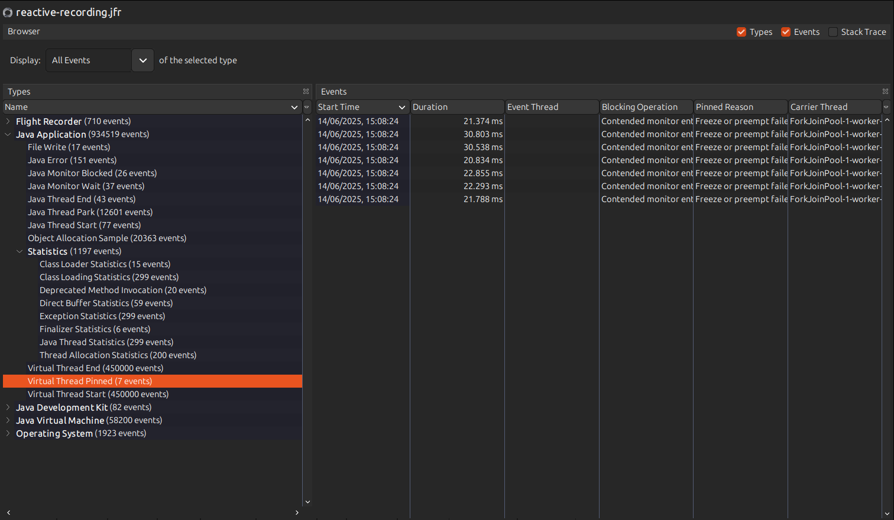
|===

[#_testing]
== 🔍 Testing

Both modules include comprehensive test coverage including::

* Unit tests
* Loading tests
- link:./testing/k6/Readme.md[K6]
- link:./testing/jmeter/Readme.md[JMeter]
- link:./testing/gatling/Readme.md[Gatling]

Run unit tests with:

[source,bash]
----
# Run all tests
mvn test && gradle test
----

[#_performance_comparison]
== ⚡ Performance Comparison

This project allows comparing::

* Response times under load
* Resource utilization (CPU, memory)
* Throughput capabilities
* Scalability characteristics

between the traditional thread-per-request model and the reactive event-loop model.

=== Java Performance Scenarios Comparison

Here's a table explaining 6 scenarios with performance indicators:

[cols="1,2,2,2,3,2,2,2,2", options="header", width=75%, frame=none, grid=none, title="Performance Scenarios Comparison"]
|===
| # | Approach | Virtual Threads | Native Build | Response Time by Thread | CPU Usage | Memory Usage | Startup Time | Learning Curve

| 1 | Imperative | ❌ | ❌ | 🚨 | 🚨 | 🚨 | 🚨 | 💪++
| 2 | Imperative | ✅ | ❌ | 💪 | 💪 | 💪+ | 🚨 | 💪+
| 3 | Imperative | ✅ | ✅ | 💪+ | 💪++ | 💪+ | 💪 | 💪
| 4 | Reactive | ❌ | ❌ | 💪++ | 💪+ | 💪+ | 🚨 | 💪
| 5 | Reactive | ❌ | ✅ | 💪++ | 💪++ | 💪+ | 💪 | 🚨
| 6 | Reactive | ✅ | ✅ | 💪++ | 💪++ | 💪++ | 💪 | 🚨--
|===

==== Legend

* ✅ Enabled
* ❌ Not present
* 💪 Better
* 🚨 Worse

====
Key Observations:
----
Native builds (scenarios 3, 5, 6) consistently show better memory usage and startup time
----
----
Virtual threads improve performance in both programming models
----
----
Imperative approach offers a better learning curve, especially without native compilation
----
----
Reactive + (Virtual Threads or Native) (scenarios 5, 6) provides the best overall performance characteristics
----
----
Imperative + Virtual Threads + Native (scenario 3) offers excellent performance with a simpler programming model
----
====

=== Summary of K6 Tests

* link:http://localhost:5665/ui/[K6 Web Dashboard] (While the test is running)
* link:./testing/k6/result/summary.html[K6 Report]

[cols="1,1,1,1,1,1,1,1,1", options="header", width=100%, frame=none, grid=none, title="K6 Table Comparison"]
|===
| Scenario | Count | Rate | Average | Maximum | Median | Minimum | 90th Percentile | 95th Percentile
| 3 | 75462 | 359.03 | 812.49 | 48206.40 | 300.97 | 300.38 | 473.25 | 944.87
| 6 | 75462 | 359.03 | 309.74 | 600.70 | 301.11 | 300.40 | 328.08 | 357.04
|===

[cols="1,1", options="header", width=100%, frame=none, grid=none, title="K6 Graph Comparison"]
|===
| Imperative | Reactive
| 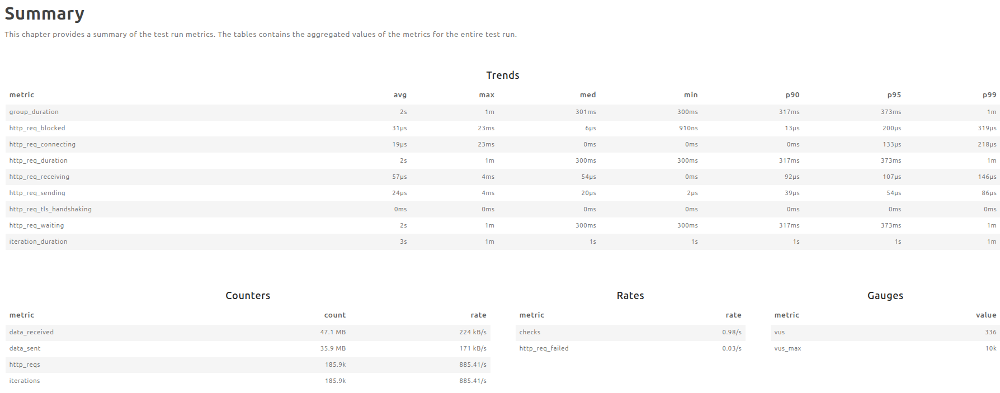 | 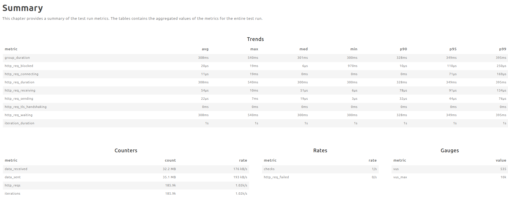
| 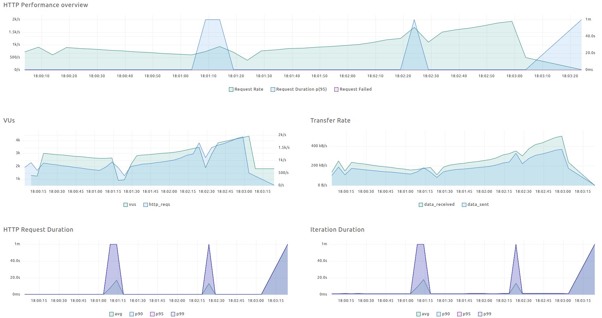 | 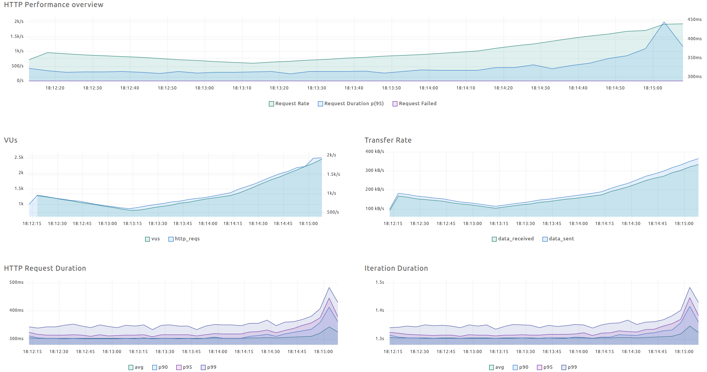
| 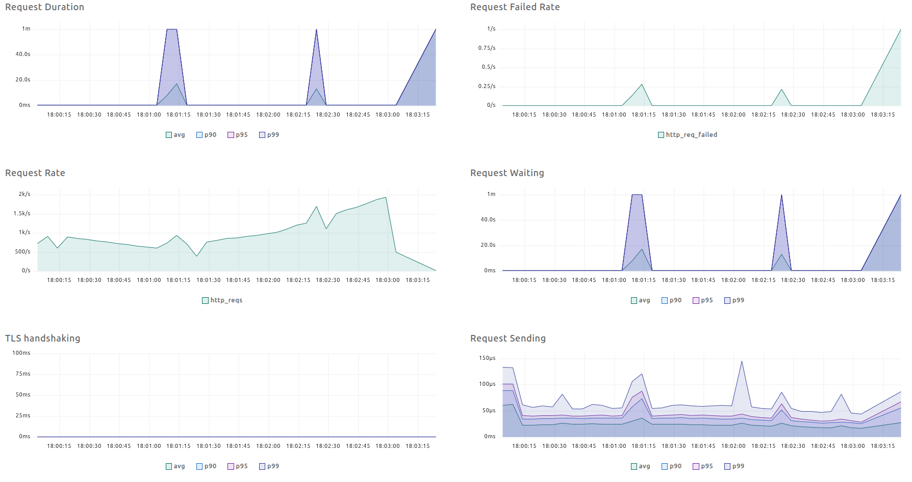 | 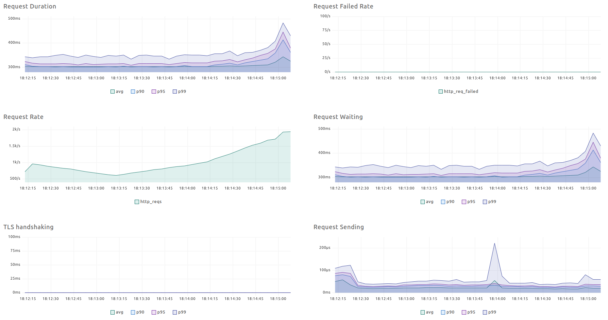
|===

=== Summary of JMeter Tests

* link:./testing/jmeter/reports/html/index.html[JMeter Report]

[cols="1,2,1,1,2,1,1,1,1,1,1,2,2,2", options="header", width=100%, frame=none, grid=none, title="JMeter Table Comparison"]
|===
| Scenario | Executions Samples | FAIL | Error % | Response Times (ms) Average | Min | Max | Median | 90th pct | 95th pct | 99th pct | Throughput Transactional/s | Network (KB/sec) Received | Network (KB/sec) Sent
| 3 | 140000 | 0 | 0.00% | 304.44 | 300 | 486 | 302.00 | 303.00 | 316.00 | 400.00 | 738.86 | 183.27 | 188.32
| 6 | 140000 | 0 | 0.00% | 302.99 | 300 | 382 | 302.00 | 302.00 | 311.00 | 335.00 | 737.24 | 110.87 | 186.47
|===

[cols="1,1", options="header", width=100%, frame=none, grid=none, title="JMeter Graph Comparison"]
|===
| Imperative | Reactive
| 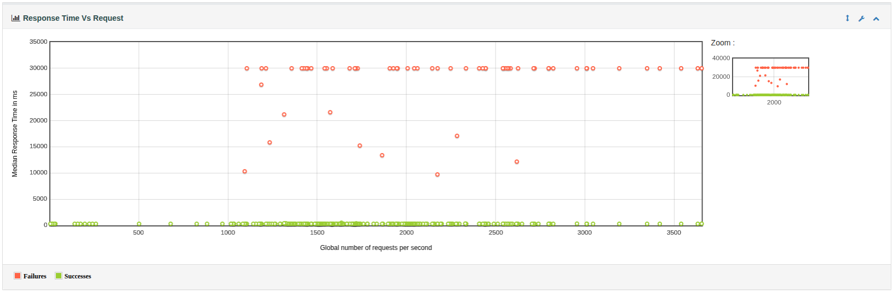 | 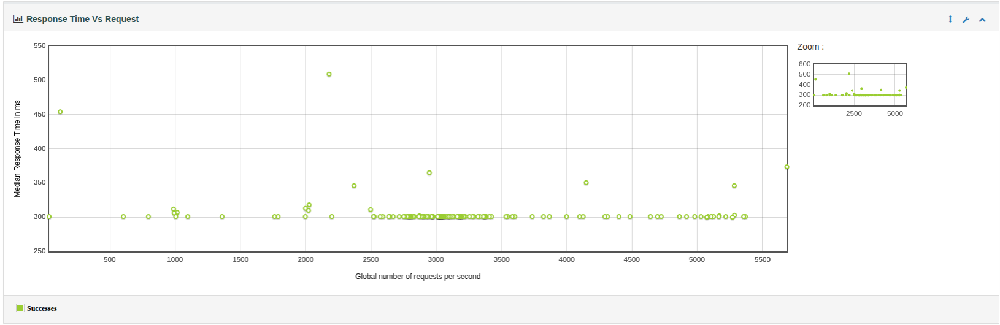
| 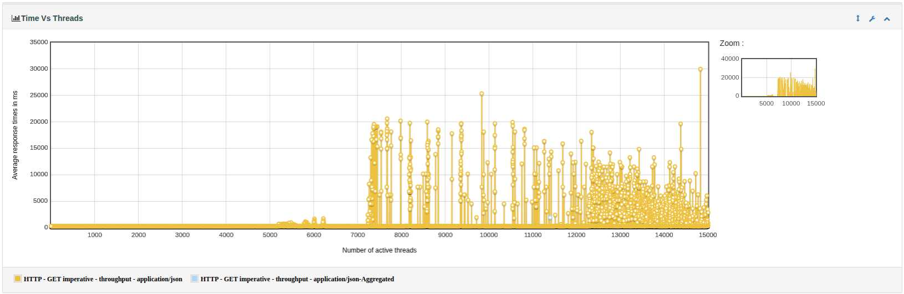 | 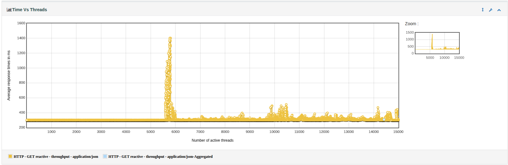
| 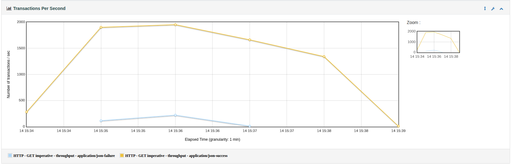 | 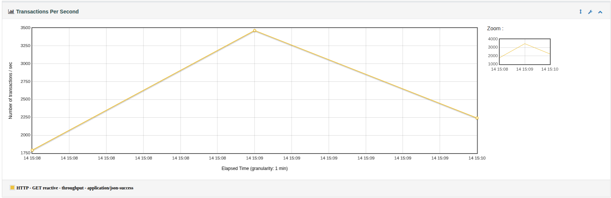
|===

=== Summary of Gatling Tests

[cols="1,2,1,1,1,1,2,1,1,1,1,1,1,1", options="header", width=100%, frame=none, grid=none, title="Gatling Table Comparison"]
|===
| Scenario | Executions Total | OK | KO | % KO | Crit/s | Response Time (ms) Min | 50th pct | 75th pct | 95th pct | 99th pct | Max | Mean | Std Dev
| 3 | 120314 | 106749 | 13566 | 11.28 | 661.07 | 56 | 307 | 363 | 14593 | 24284 | 29093 | 2401 | 4878
| 6 | 120314 | 107293 | 13016 | 10.82 | 661.07 | 13 | 307 | 479 | 7143 | 7675 | 15082 | 1363 | 2339
|===

[cols="1,1",options="header", width=100%, frame=none, grid=none, title="Gatling Graph Comparison"]
|===
| Imperative | Reactive
| 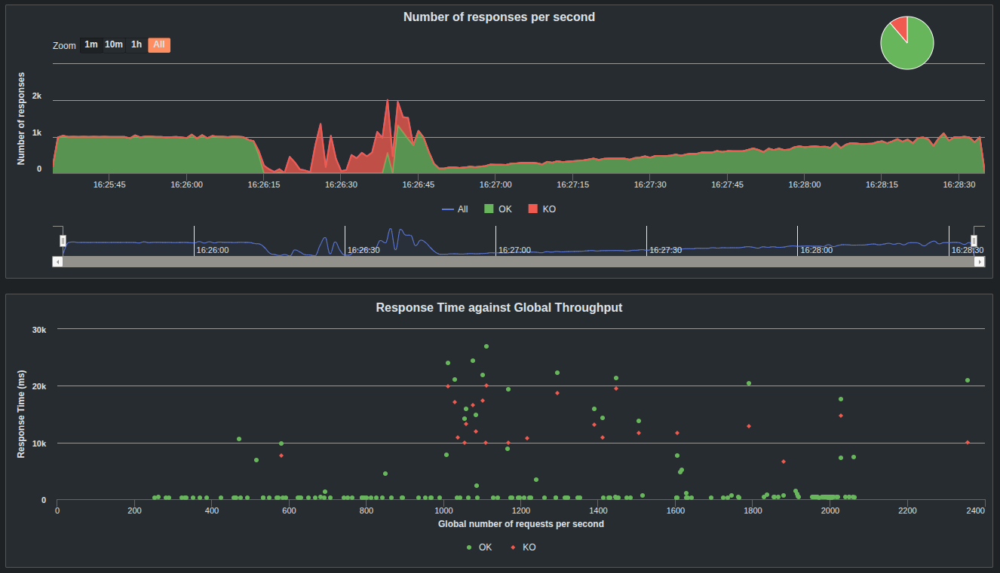 | 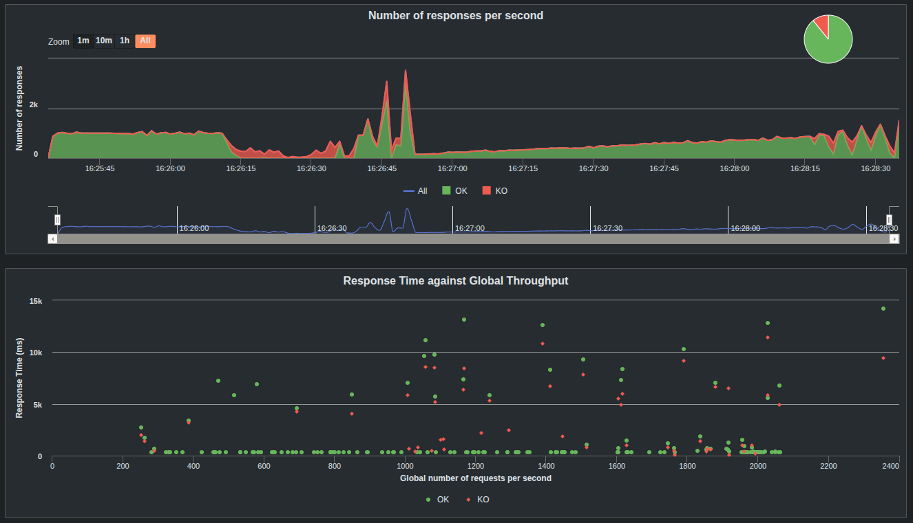
|===

[#_references]
== 📚 References

* link:https://www.alibabacloud.com/blog/exploration-of-java-virtual-threads-and-performance-analysis_601860[Exploration of Java Virtual Threads and Performance Analysis]
* link:https://www.tatvasoft.com/blog/java-reactive-programming/[Why Do We Need Java Reactive Programming?]
* link:https://luxoft-training.com/blog/virtual-threads-in-java-21[Virtual threads in Java 21]
* link:https://www.geeksforgeeks.org/reactor-webflux-vs-virtual-threads/[Reactor WebFlux vs Virtual Threads]
* link:https://www.mongodb.com/developer/languages/java/virtual-threads-reactive-programming/[How to Optimize Java Performance With Virtual Threads, Reactive Programming, and MongoDB]
* link:https://www.diva-portal.org/smash/get/diva2:1763111/FULLTEXT01.pdf[Comparing Virtual Threads and Reactive Webflux in Spring]